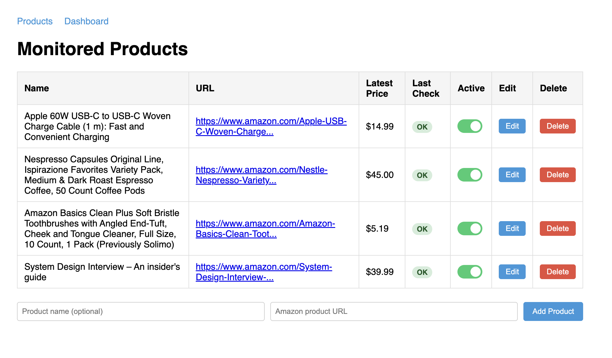
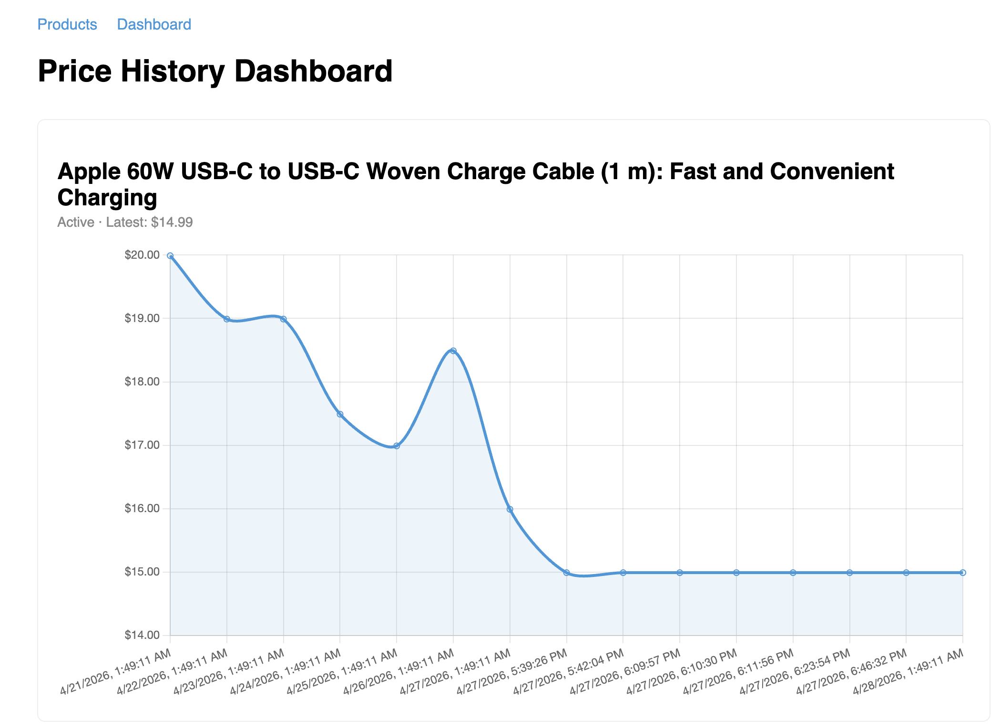
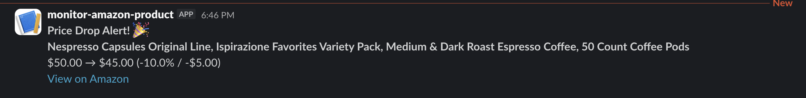

# Amazon Price Monitor

Monitors Amazon product prices and sends a Slack notification when a price drop is detected.

## Development Approach

This project was built with a structured planning-first approach using Claude Code as an AI assistant.

1. **[Requirements](docs/requirements.md)** — Started by thoroughly reading the brief and extracting every requirement and evaluation criterion.

2. **[Requirement Analysis](docs/clarify-requirements.md)** — Went through each requirement one by one with Claude to make concrete decisions: what to build, what to skip, and why. Covered scheduling strategy, storage choice, notification method, threshold logic, stretch goals, and panel discussion points.

3. **[Architecture](docs/architecture.md)** — Defined the full system design: tech stack with rationale, data flow diagram, DB schema, endpoints, and test strategy. Updated iteratively as decisions were finalized.

4. **[Implementation Plan](docs/implementation.md)** — Broke the build into 9 sequential steps and executed them one at a time, checking off each item as it was completed.

5. **[Design Doc](docs/design.md)** — Documented the four key tradeoffs, stretch goal outcomes, and known gaps — the primary material for the panel discussion.

6. **[AI-NOTES](docs/AI-NOTES.md)** — Recorded five cases where the AI assistant produced incomplete or incorrect work, and how each was caught and corrected.

---

## Screenshots

### Product Management


### Price History Dashboard


### Slack Notification


## Requirements

- Java 21
- Docker Desktop (includes Docker Compose v2)

> **Install Java 21 (Mac):**
> ```bash
> brew install --cask temurin@21
> ```
> Verify: `java -version`

> **Install Docker Desktop (Mac):**
> ```bash
> brew install --cask docker
> ```
> Then open the Docker app from Applications once — the daemon must be running before using `docker` commands.
> Verify: `docker --version`

## Setup

### 1. Clone and configure

```bash
git clone https://github.com/jinjungs/monitor-amazon-product.git
cd monitor-amazon-product

cp .env.example .env
```

Edit `.env` and fill in the values:

```
DB_PASSWORD=any_password_you_choose
SLACK_WEBHOOK_URL=https://hooks.slack.com/services/YOUR/WEBHOOK/URL
```

> **Slack webhook:** go to [api.slack.com/apps](https://api.slack.com/apps) → Create App → Incoming Webhooks → Activate → Add to Workspace → copy the URL.

---

## Run

### Option A — Local (recommended for development)

Start PostgreSQL only:

```bash
docker compose up db -d
```

Export env vars and run the app:

```bash
export $(grep -v '^#' .env | xargs)
./mvnw spring-boot:run
```

### Option B — Full Docker

```bash
./mvnw clean package -DskipTests
docker compose up --build
```

---

## Verify

Open [http://localhost:8080/products](http://localhost:8080/products) and add at least 3 Amazon product URLs.

The scheduler runs every **1 hour** by default. To trigger a check immediately for testing, set a short interval in `application.yml`:

```yaml
monitor:
  interval-ms: 30000  # 30 seconds
```

When a price drop is detected, a Slack message appears in your channel:

```
Price Drop Alert! 🎉
Product Name
$6.00 → $5.19 (-13.5% / -$0.81)
View on Amazon
```

Price history is visible at [http://localhost:8080/dashboard](http://localhost:8080/dashboard).

---

## Configuration

All parameters are in `application.yml` — no code changes needed:

| Parameter | Default | Description |
|---|---|---|
| `monitor.interval-ms` | `3600000` | Check interval in ms (1 hour) |
| `monitor.threshold.absolute` | `1.00` | Notify if drop ≥ $1.00 |
| `monitor.threshold.percentage` | `2.0` | Notify if drop ≥ 2% (OR logic) |
| `monitor.thread-pool.core-size` | `3` | Concurrent scrape threads |

Secrets (`DB_PASSWORD`, `SLACK_WEBHOOK_URL`) go in `.env` — never committed.

---

## Testing Notifications

To verify the Slack notification works without waiting for a real price drop:

**1. Start Adminer (database UI)**

```bash
docker compose up adminer -d
```

Open [http://localhost:8081](http://localhost:8081) and log in:

| Field | Value |
|---|---|
| System | PostgreSQL |
| Server | db |
| Username | monitor |
| Password | (your `DB_PASSWORD`) |
| Database | pricedb |

**2. Insert a higher price for any product**

In Adminer → SQL Command:

```sql
INSERT INTO price_checks (product_id, price, currency, status, checked_at, created_at, updated_at)
VALUES (<product_id>, 99.99, 'USD', 'ok', NOW(), NOW(), NOW());
```

Replace `<product_id>` with the ID from the `products` table.

**3. Shorten the check interval**

In `application.yml`:
```yaml
monitor:
  interval-ms: 30000  # 30 seconds
```

Restart the app. Within 30 seconds the scheduler will scrape the current price, detect the drop from the inserted price, and send a Slack notification.

---

## REST API

| Method | Path | Description |
|---|---|---|
| `GET` | `/api/products` | List all monitored products |
| `POST` | `/api/products` | Add a product `{ "url": "...", "name": "..." }` |
| `DELETE` | `/api/products/{id}` | Remove a product and its price history |
| `PATCH` | `/api/products/{id}/toggle` | Toggle active / inactive |
| `PUT` | `/api/products/{id}` | Update name or URL `{ "url": "...", "name": "..." }` |
| `GET` | `/api/products/{id}/history` | Price check history as JSON |

**Example response — `GET /api/products/{id}/history`:**
```json
[
  {
    "id": 42,
    "price": 45.00,
    "currency": "USD",
    "status": "ok",
    "errorMsg": null,
    "checkedAt": "2026-04-27T18:10:30"
  }
]
```

---

## Run Tests

```bash
./mvnw test
```

Tests use H2 in-memory — no database setup needed.
